# 🏛️ Arquitetura Técnica de Referência: SaaS Multi-Tenant para Rifas & Upsell Gamificado

**Documento:** Especificação Arquitetural e Engenharia de Software  
**Versão:** 1.0.0 (MVP para Produção)  
**Contexto:** Camada de Otimização de Conversão, Recuperação de Vendas e Checkout Pix Gamificado (SorteiMe, Play55, Sorteamos)

---

## 1. Visão Geral e Princípios Arquiteturais

O sistema opera como uma **camada intermediária de inteligência (Optimization Layer)** que se posiciona entre as plataformas de rifas externas (SorteiMe, Play55, Sorteamos), os Gateways de Pagamento Pix com Split automático e o comprador final.

### Princípios Chave:
1. **Baixíssima Latência no Edge (< 50ms):** O widget embarcado (iframe ou web component) não pode travar o fluxo de compra da rifa.
2. **Isolamento Estrito Multi-Tenant (Hierárquico):** Super Admin $\rightarrow$ Parceiro White-label $\rightarrow$ Dono da Rifa (Lojista).
3. **Persistência Efêmera de Dados para Pix em 1-Clique:** Eliminação do atrito de preenchimento duplo de CPF/Telefone no pós-venda.
4. **Resiliência e Idempotência:** Webhooks de gateways e plataformas de rifas processados via fila assíncrona com chave de idempotência (`idempotency_key`).

---

## 2. Diagrama de Fluxo de Dados e Ciclo de Vida do Checkout Pix

Abaixo detalhamos as duas mecânicas críticas de conversão:
- **Estratégia A:** Order Bump Pré-Pix (Carrinho Turbinado Consolidado).
- **Estratégia B:** 1-Click Upsell Pós-Pix (Reaproveitamento de Dados via Session Token).

```mermaid
sequenceDiagram
    autonumber
    actor C as Comprador
    participant W as Widget / Raspadinha (Frontend)
    participant API as API SaaS (Core Backend)
    participant R as Cache Redis (Sessão/TTL)
    participant GW as Gateway Pix (Split Automático)
    participant WH as Worker de Webhook / Queue
    participant Rifa as Plataforma de Rifa (SorteiMe/Play55)

    %% FLUXO A: ORDER BUMP
    rect rgb(20, 30, 45)
    note right of C: FLUXO A: Order Bump Turbinado (Pré-Pix Consolidado)
    C->>W: Seleciona cotas da rifa e raspa cartela de bônus
    W->>API: POST /orders/pre-bump (Cotas Rifa + Booster + Dados Comprador)
    API->>GW: Cria Cobrança Pix Única (Valor Consolidado + Split Triplo)
    GW-->>API: Retorna Chave Pix Copia-e-Cola + QR Code
    API-->>W: Renderiza Pix Consolidado
    C->>GW: Paga Pix único no App do Banco
    GW->>WH: Webhook: pix.paid
    WH->>Rifa: Notifica liberação de cotas principais
    WH->>API: Registra cotas adicionais do upsell
    end

    %% FLUXO B: PÓS-PIX IMEDIATO
    rect rgb(30, 20, 40)
    note right of C: FLUXO B: 1-Click Upsell Pós-Pix Imediato
    C->>Rifa: Conclui compra das cotas originais via Pix
    Rifa->>API: Webhook/Redirect: order.created/paid (Nome, CPF, Tel, OrderID)
    API->>R: Grava Session Token [session_xyz] com dados do cliente (TTL 30min)
    Rifa-->>W: Carrega tela de Sucesso com Iframe do Upsell + Vturb VSL
    C->>W: Assiste vídeo / Raspa raspadinha e clica em "ATIVAR BOOSTER"
    W->>API: POST /upsell/accept (session_token: session_xyz, offer_id: 110x)
    API->>R: Recupera CPF, Nome e Telefone cacheados
    API->>GW: Gera 2º Pix Instantâneo (Dados recuperados, sem digitação)
    GW-->>API: Retorna Pix Copia e Cola instantâneo
    API-->>W: Abre Modal Pix com contagem regressiva e cópia automática
    C->>GW: Paga o Pix do Upsell
    GW->>WH: Webhook: upsell.paid
    WH->>Rifa: Injeta cotas extras via API da rifa
    WH->>W: WebSocket / SSE atualiza tela: "Booster Ativado com Sucesso!"
    end
```



---

## 3. Modelagem de Banco de Dados (Schema PostgreSQL Multi-Tenant)

O isolamento multi-tenant adota o modelo **Shared Database, Shared Schema com Row-Level Security (RLS)** e particionamento nas tabelas de transações de alto volume.

```sql
-- Habilita UUID v4
CREATE EXTENSION IF NOT EXISTS "uuid-ossp";

-- 1. WORKSPACES (Isolamento Multi-Tenant Hierárquico)
CREATE TYPE workspace_type AS ENUM ('super_admin', 'partner_whitelabel', 'merchant');

CREATE TABLE workspaces (
    id UUID PRIMARY KEY DEFAULT uuid_generate_v4(),
    parent_id UUID REFERENCES workspaces(id) ON DELETE SET NULL, -- Parceiro White-label -> Lojista
    type workspace_type NOT NULL DEFAULT 'merchant',
    name VARCHAR(150) NOT NULL,
    slug VARCHAR(100) UNIQUE NOT NULL,
    document VARCHAR(20), -- CNPJ ou CPF
    gateway_provider VARCHAR(50) DEFAULT 'pagarme', -- 'pagarme', 'asaas', 'openpix', 'mercadopago'
    gateway_credentials JSONB DEFAULT '{}', -- Chaves de API encriptadas
    split_recipient_id VARCHAR(100), -- ID do recebedor na adquirente
    status VARCHAR(20) DEFAULT 'active',
    created_at TIMESTAMP WITH TIME ZONE DEFAULT NOW(),
    updated_at TIMESTAMP WITH TIME ZONE DEFAULT NOW()
);

-- 2. USUÁRIOS E PERMISSÕES (RBAC)
CREATE TYPE user_role AS ENUM ('super_admin', 'partner_admin', 'merchant_admin', 'merchant_operator');

CREATE TABLE users (
    id UUID PRIMARY KEY DEFAULT uuid_generate_v4(),
    name VARCHAR(150) NOT NULL,
    email VARCHAR(255) UNIQUE NOT NULL,
    password_hash VARCHAR(255) NOT NULL,
    phone VARCHAR(25),
    created_at TIMESTAMP WITH TIME ZONE DEFAULT NOW()
);

CREATE TABLE workspace_memberships (
    workspace_id UUID NOT NULL REFERENCES workspaces(id) ON DELETE CASCADE,
    user_id UUID NOT NULL REFERENCES users(id) ON DELETE CASCADE,
    role user_role NOT NULL,
    created_at TIMESTAMP WITH TIME ZONE DEFAULT NOW(),
    PRIMARY KEY (workspace_id, user_id)
);

-- 3. REGRAS DE SPLIT & COMISSIONAMENTO POR PARCERIA
CREATE TABLE partner_split_rules (
    id UUID PRIMARY KEY DEFAULT uuid_generate_v4(),
    partner_workspace_id UUID NOT NULL REFERENCES workspaces(id),
    merchant_workspace_id UUID REFERENCES workspaces(id), -- Null = padrão global do parceiro
    saas_rate_percentage NUMERIC(5, 2) NOT NULL DEFAULT 10.00, -- Nossa taxa
    partner_rate_percentage NUMERIC(5, 2) NOT NULL DEFAULT 5.00, -- Taxa do parceiro white-label
    merchant_rate_percentage NUMERIC(5, 2) NOT NULL DEFAULT 85.00, -- Dono da rifa
    absorb_gateway_fees VARCHAR(20) DEFAULT 'merchant', -- Quem absorve taxas ('saas', 'partner', 'merchant')
    created_at TIMESTAMP WITH TIME ZONE DEFAULT NOW()
);

-- 4. CAMPANHAS DE RIFAS
CREATE TABLE campaigns (
    id UUID PRIMARY KEY DEFAULT uuid_generate_v4(),
    workspace_id UUID NOT NULL REFERENCES workspaces(id),
    external_platform VARCHAR(50) NOT NULL, -- 'sorteime', 'play55', 'sorteamos'
    external_campaign_id VARCHAR(100) NOT NULL,
    title VARCHAR(255) NOT NULL,
    ticket_price NUMERIC(10, 2) NOT NULL,
    status VARCHAR(30) DEFAULT 'active',
    created_at TIMESTAMP WITH TIME ZONE DEFAULT NOW(),
    UNIQUE (workspace_id, external_platform, external_campaign_id)
);

-- 5. OFERTAS DE UPSELL & CONFIGURAÇÃO GAMIFICADA
CREATE TYPE offer_type AS ENUM ('pre_bump', 'post_pix_scratch', 'vsl_scratch', 'double_scratch');

CREATE TABLE upsell_offers (
    id UUID PRIMARY KEY DEFAULT uuid_generate_v4(),
    campaign_id UUID NOT NULL REFERENCES campaigns(id) ON DELETE CASCADE,
    type offer_type NOT NULL DEFAULT 'post_pix_scratch',
    title VARCHAR(150) NOT NULL,
    subtitle VARCHAR(255),
    price NUMERIC(10, 2) NOT NULL,
    quota_count INT NOT NULL, -- Ex: 110 cotas
    vturb_video_id VARCHAR(100), -- ID do player Vturb
    theme_config JSONB DEFAULT '{
        "color_primary": "#2563EB",
        "color_accent": "#63D8FF",
        "scratch_color": "#C0C0C0",
        "audio_enabled": true
    }',
    is_active BOOLEAN DEFAULT TRUE,
    created_at TIMESTAMP WITH TIME ZONE DEFAULT NOW()
);

-- 6. CLIENTES / COMPRADORES (Centralização de Leads para Recuperação)
CREATE TABLE customers (
    id UUID PRIMARY KEY DEFAULT uuid_generate_v4(),
    workspace_id UUID NOT NULL REFERENCES workspaces(id),
    name VARCHAR(150) NOT NULL,
    phone VARCHAR(25) NOT NULL,
    cpf VARCHAR(14) NOT NULL,
    email VARCHAR(255),
    created_at TIMESTAMP WITH TIME ZONE DEFAULT NOW(),
    updated_at TIMESTAMP WITH TIME ZONE DEFAULT NOW(),
    UNIQUE (workspace_id, cpf)
);

CREATE INDEX idx_customers_phone_workspace ON customers(workspace_id, phone);

-- 7. PEDIDOS & SESSÕES DE CONVERSÃO
CREATE TYPE order_flow_type AS ENUM ('standard', 'pre_bump_consolidated', 'post_pix_upsell');
CREATE TYPE order_status AS ENUM ('pending', 'paid', 'abandoned', 'expired', 'refunded');

CREATE TABLE orders (
    id UUID PRIMARY KEY DEFAULT uuid_generate_v4(),
    workspace_id UUID NOT NULL REFERENCES workspaces(id),
    campaign_id UUID NOT NULL REFERENCES campaigns(id),
    customer_id UUID NOT NULL REFERENCES customers(id),
    external_order_id VARCHAR(100),
    flow_type order_flow_type NOT NULL,
    base_amount NUMERIC(10, 2) NOT NULL,
    upsell_amount NUMERIC(10, 2) DEFAULT 0.00,
    total_amount NUMERIC(10, 2) NOT NULL,
    status order_status DEFAULT 'pending',
    utm_source VARCHAR(100),
    utm_medium VARCHAR(100),
    utm_campaign VARCHAR(100),
    created_at TIMESTAMP WITH TIME ZONE DEFAULT NOW(),
    paid_at TIMESTAMP WITH TIME ZONE
);

CREATE INDEX idx_orders_workspace_created ON orders(workspace_id, created_at DESC);

-- 8. TRANSAÇÕES PIX & SPLITS DETALHADOS
CREATE TYPE transaction_type AS ENUM ('main_order', 'upsell_order', 'consolidated_order');
CREATE TYPE transaction_status AS ENUM ('pending', 'paid', 'expired', 'failed');

CREATE TABLE transactions (
    id UUID PRIMARY KEY DEFAULT uuid_generate_v4(),
    order_id UUID NOT NULL REFERENCES orders(id),
    type transaction_type NOT NULL,
    gateway VARCHAR(50) NOT NULL,
    gateway_tx_id VARCHAR(150) NOT NULL,
    pix_copy_paste TEXT NOT NULL,
    pix_qr_code_url TEXT,
    amount NUMERIC(10, 2) NOT NULL,
    split_details JSONB NOT NULL, -- Valores calculados: {"saas": 2.00, "partner": 1.00, "merchant": 17.00}
    status transaction_status DEFAULT 'pending',
    expires_at TIMESTAMP WITH TIME ZONE NOT NULL,
    paid_at TIMESTAMP WITH TIME ZONE,
    created_at TIMESTAMP WITH TIME ZONE DEFAULT NOW()
);

CREATE INDEX idx_transactions_gateway_id ON transactions(gateway, gateway_tx_id);

-- 9. EVENTOS E TELEMETRIA DE CONVERSÃO (Para o Dashboard em Tempo Real)
CREATE TABLE conversion_events (
    id BIGSERIAL PRIMARY KEY,
    workspace_id UUID NOT NULL REFERENCES workspaces(id),
    order_id UUID REFERENCES orders(id),
    upsell_offer_id UUID REFERENCES upsell_offers(id),
    event_name VARCHAR(50) NOT NULL, -- 'view', 'video_play', 'scratch_start', 'scratch_win', 'pix_generated', 'pix_paid'
    metadata JSONB DEFAULT '{}',
    created_at TIMESTAMP WITH TIME ZONE DEFAULT NOW()
);

CREATE INDEX idx_conversion_events_workspace_event ON conversion_events(workspace_id, event_name, created_at DESC);

-- 10. FILA DE RECUPERAÇÃO DE CARRINHO ABANDONADO (WhatsApp / API)
CREATE TABLE abandoned_recovery_jobs (
    id UUID PRIMARY KEY DEFAULT uuid_generate_v4(),
    workspace_id UUID NOT NULL REFERENCES workspaces(id),
    order_id UUID NOT NULL REFERENCES orders(id),
    customer_id UUID NOT NULL REFERENCES customers(id),
    channel VARCHAR(30) DEFAULT 'whatsapp',
    status VARCHAR(30) DEFAULT 'scheduled', -- 'scheduled', 'sent', 'converted', 'failed'
    attempts INT DEFAULT 0,
    scheduled_for TIMESTAMP WITH TIME ZONE NOT NULL,
    sent_at TIMESTAMP WITH TIME ZONE,
    converted_at TIMESTAMP WITH TIME ZONE
);
```

---

## 4. Stack Tecnológica Recomendada (Foco em Baixa Latência & Escala)

| Camada | Tecnologia Escolhida | Justificativa Técnica |
| :--- | :--- | :--- |
| **Widget / Embed** | **Vanilla TS + CSS Puro** (Compilado via Vite em micro-bundle < 25KB) | Não usa React/Vue no iframe. Latência zero de renderização em dispositivos móveis 3G/4G. |
| **CDN & Edge Cache** | **Cloudflare Enterprise / Workers** | Cache de assets estáticos (áudio, imagens, estilos) em edge distribuído próximo ao usuário. |
| **Backend API Core** | **Node.js com Fastify (TypeScript)** ou **Go (Golang)** | Fastify entrega ~30.000 req/s com baixo consumo de memória e validação nativa via JSON Schema. |
| **Filas & Cache Rápido** | **Redis (Cluster) + BullMQ** | Sessões de checkout instantâneas (TTL 30 min), Pub/Sub para WebSockets e fila de webhooks assíncronos. |
| **Banco de Dados Principal** | **PostgreSQL 16 (AWS RDS Aurora)** | ACID rigoroso, JSONB de alta performance e suporte maduro a Row-Level Security (RLS). |
| **Realtime Updates** | **Server-Sent Events (SSE) / WebSockets** | Atualiza instantaneamente o modal assim que o Pix do upsell for compensado no banco. |
| **Disparo WhatsApp** | **Evolution API / Z-API** em infraestrutura Docker isolada | Conexão headless ultra-rápida para recuperação de vendas com tags UTM e chave Pix embutida. |

---

## 5. Endpoints Essenciais da API (Contratos REST / JSON)

### 5.1. Handshake & Ingestão de Webhook da Plataforma de Rifa
* **Endpoint:** `POST /api/v1/integrations/:platform/webhook`
* **Descrição:** Recebe aviso de compra ou intenção de compra da SorteiMe / Play55.
* **Payload de Entrada:**
```json
{
  "event": "order.created",
  "external_order_id": "ord_994821",
  "campaign_id": "rifa_bobzao_bitruck",
  "customer": {
    "name": "Isaias Rodrigues",
    "cpf": "123.456.789-00",
    "phone": "5511999998888",
    "email": "isaias@email.com"
  },
  "order": {
    "amount": 50.00,
    "quotas": 10,
    "status": "paid"
  }
}
```
* **Resposta (Gera Session Token para o Iframe):**
```json
{
  "status": "success",
  "session_token": "sess_8f7b2a9c1e",
  "upsell_url": "https://upscale.me/frame?session=sess_8f7b2a9c1e",
  "has_active_offer": true
}
```

---

### 5.2. Aceite do 1-Click Upsell Pós-Pix (Geração do 2º Pix sem digitação)
* **Endpoint:** `POST /api/v1/upsell/accept`
* **Descrição:** Acionado quando o usuário raspa e clica em "QUERO MEU BOOSTER". Os dados cadastrais são resgatados do Redis pelo `session_token`.
* **Payload de Entrada:**
```json
{
  "session_token": "sess_8f7b2a9c1e",
  "offer_id": "off_booster110x"
}
```
* **Resposta (Pix Gerado com Split Automático):**
```json
{
  "status": "success",
  "transaction_id": "tx_pix_449201",
  "amount": 90.00,
  "pix": {
    "copy_paste": "00020126580014br.gov.bcb.pix0136123e4567-e89b-12d3-a456-426614174000520400005303986540590.005802BR...",
    "qr_code_base64": "data:image/png;base64,iVBORw0KGgoAAAANSUhEUgAA...",
    "expires_at": "2026-09-14T14:05:00Z"
  },
  "split_preview": {
    "saas_fee": 9.00,
    "partner_fee": 4.50,
    "merchant_net": 76.50
  }
}
```

---

### 5.3. Status em Tempo Real da Transação (Long Polling ou SSE)
* **Endpoint:** `GET /api/v1/transactions/:transaction_id/status`
* **Descrição:** O frontend consulta a cada 2s (ou escuta via SSE) para fechar o modal e celebrar a ativação assim que o webhook bancário confirmar o pagamento.
* **Resposta:**
```json
{
  "status": "paid",
  "paid_at": "2026-09-14T13:58:22Z",
  "quotas_injected": 110,
  "celebration_url": "https://upscale.me/success?tx=tx_pix_449201"
}
```

---

### 5.4. Métricas do Dashboard do Cliente (Workspace Lojista)
* **Endpoint:** `GET /api/v1/analytics/dashboard`
* **Headers:** `Authorization: Bearer <token_lojista>`, `X-Workspace-Id: <id>`
* **Resposta:**
```json
{
  "period": "last_30_days",
  "gross_revenue": 145800.00,
  "upsell_recovered_revenue": 38450.00,
  "aov_increase_percentage": 26.37,
  "abandoned_carts": {
    "total_detected": 420,
    "recovered_count": 118,
    "recovered_amount": 10620.00,
    "recovery_rate_percentage": 28.09
  },
  "channels_conversion": [
    { "source": "instagram_ads", "views": 12400, "conversion_rate": 8.4 },
    { "source": "whatsapp_direct", "views": 3200, "conversion_rate": 19.8 },
    { "source": "influencer_x", "views": 8900, "conversion_rate": 11.2 }
  ]
}
```
